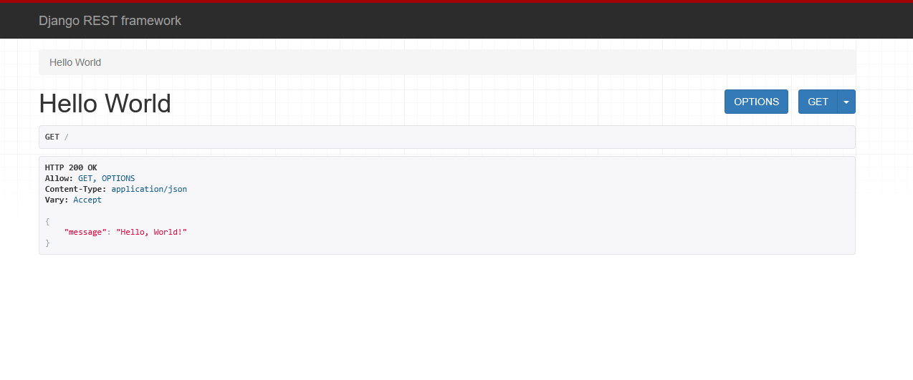

# Building a Simple API

Now that we have Django REST Framework installed and a basic Django project set up, let's configure Django REST Framework.

## Creating Your First API View

Navigate to your project's **core** folder and add the following code to **urls.py**:

```py
# core/urls.py

from django.contrib import admin
from django.urls import path
from rest_framework.decorators import api_view
from rest_framework.response import Response


@api_view(["GET"])
def hello_world(request):
    return Response({"message": "Hello, World!"}, status=200)


urlpatterns = [
    path("admin/", admin.site.urls),
    path("", hello_world, name="hello_world"),
]
```

In Django REST Framework, you can create function-based views by decorating a Python function with `@api_view`. This decorator specifies which HTTP methods the view accepts (in this case, GET).

Every Django view requires a `request` object as a parameter and must return a `Response` object. The `Response` contains the data to send back and an HTTP status code.

Finally, register the view in `urlpatterns` to map it to a URL endpoint.

## Register Django REST Framework

Since DRF is an external package, you must add it to your **core/settings.py**. Locate the `INSTALLED_APPS` list and add `'rest_framework'`:

```py
# core/settings.py

INSTALLED_APPS = [
    'django.contrib.admin',
    'django.contrib.auth',
    'django.contrib.contenttypes',
    'django.contrib.sessions',
    'django.contrib.messages',
    'django.contrib.staticfiles',
    'rest_framework',
]
```

Visit **http://localhost:8000** to see your API response:



And just like that, we have created our first API route.

### Exercise
Create two API routes of your choice that return a response.