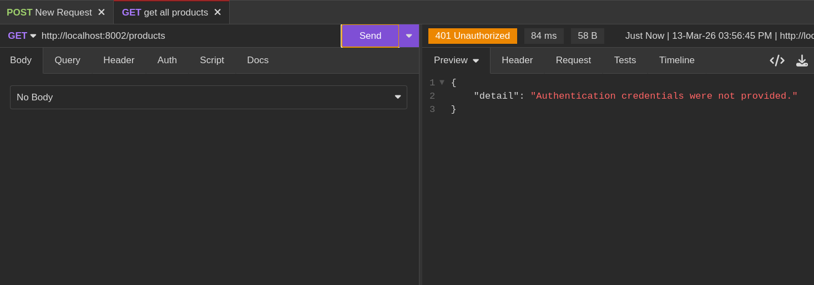

# Authentication and Authorization in Django REST Framework

Authentication is the fundamental process of identifying the user making a request to an API. By associating each incoming request with a specific set of identifying credentials, an application can determine whether to grant or restrict access to its various resources.


It is important to distinguish this from **Authorization** (or Permissions), which determines what an authenticated user is actually allowed to do.

Django Rest Framework (DRF) is designed with a highly modular authentication system. It provides several built-in schemes that cater to common web development needs, while simultaneously offering the flexibility to implement custom authentication logic for specialized requirements.

## Token-Based Authentication

Token Authentication is a stateless mechanism where a client proves its identity by presenting a unique, secret string known as a "token." Unlike session-based authentication, which often relies on browser cookies and server-side state, Token Authentication is ideal for cross-platform APIs, including mobile applications and third-party integrations. By using tokens, users avoid sending sensitive credentials like usernames and passwords with every single request.

### Conceptual Implementation and Workflow

Setting up Token Authentication in DRF involves a few key architectural steps:

1.  **Project Configuration**: The authentication system must be registered within the project's global settings. This includes adding the framework's internal authentication app to the list of installed applications and defining the default authentication schemes the project should utilize.

```py
INSTALLED_APPS = [
    # ... other apps
    # third party apps
    "rest_framework",
    "rest_framework.authtoken",
    "django_filters"
]

# ... other settings

REST_FRAMEWORK = {
    "DEFAULT_AUTHENTICATION_CLASSES": [
        "rest_framework.authentication.TokenAuthentication"
    ]
}
```

2.  **Authentication Classes**: You can specify that the project should prioritize `TokenAuthentication`. This ensures that for every incoming request, the framework attempts to validate the credentials against the database's token records.
3.  **Token Generation**: Each user requires a unique token. These can be generated manually via the command-line interface.

```sh
python3 manage.py drf create_token <username>
```

Alternatively, this process can be automated through the use of **Signals**. A common best practice is to attach a signal to the User model, ensuring that every time a new account is created, a corresponding authentication token is automatically provisioned.

```py
# in a signals.py
from django.conf import settings
User = settings.AUTH_USER_MODEL

@receiver(post_save, sender=User)
def create_auth_token(sender, instance=None, created=False, **kwargs):
    if created:
        Token.objects.create(user=instance) 
```

4.  **The Authorization Header**: Once a token is acquired, the client must include it in the headers of every request. The standard format uses the `Authorization` header, prefixed by the word `Token`, followed by the secret string itself.
5.  **Acquiring Tokens**: For a client to receive their token initially, the API must expose a specific endpoint geared toward credential exchange. When a user provides valid login details (username and password) to this endpoint, the server responds with their unique token.

```py
# ... other code here
from rest_framework.authtoken.views import obtain_auth_token

# ... other code here

urlpatterns = [
    path("admin/", admin.site.urls),
    path("", HelloWorldView.as_view(), name="hello_world"),
    path("products/", include("products.urls")),
    path("auth/token/", obtain_auth_token) # add this
]
```

### Resource Protection

Endpoints are secured by applying **Permission Classes** to the views. For instance, using the `IsAuthenticated` class ensures that only requests with a valid, verified token can access the underlying data or perform actions.

```py
class ProductListCreateView(ListCreateAPIView):
    queryset = Product.objects.all()
    serializer_class = ProductSerializer
    filter_backends = [DjangoFilterBackend]
    filterset_class = ItemFilter
    permission_classes = [IsAuthenticated]
```



*When an unauthenticated request attempts to access a protected resource, the server responds with a 401 Unauthorized or 403 Forbidden status.*

The process of obtaining a token usually happens at a dedicated authentication path, such as `/auth/token`.


Once the client has safely stored the token, it can be passed in subsequent requests to gain access to restricted parts of the API.


## JSON Web Token (JWT) Authentication

JSON Web Token (JWT) authentication represents a more modern and highly scalable approach to security. Often pronounced "jot," a JWT is a compact, URL-safe means of representing claims to be transferred between two parties. The primary advantage of JWTs is that they are self-contained; they carry all the necessary user information within the token itself, allowing the server to verify the user without querying the database for every single request.

### The Anatomy of a JWT

A JWT is composed of three distinct parts, each separated by a dot (`.`):

*   **Header**: This section defines the metadata for the token, specifying the type of token (JWT) and the signing algorithm being used (such as HMAC SHA256 or RSA).
*   **Payload**: The payload contains the "claims." These are statements about the user and additional data, such as the user ID or expiration time. While this data is encoded and protected against tampering, it is not encrypted, meaning sensitive data should not be stored here.
*   **Signature**: The signature is the most critical security component. It is created by taking the encoded header, the encoded payload, and a secret key known only to the server, then running them through the specified algorithm. This ensures that the token remains valid and has not been altered during transit.

The resulting structure consistently follows the format: `header.payload.signature`.


### The JWT Lifecycle

1.  **Authentication**: The client logs in by providing credentials to the server.
2.  **Issuance**: Upon verification, the server issues a JWT. The client typically receives a pair of tokens: an **Access Token** and a **Refresh Token**.
3.  **Transmission**: For all subsequent requests, the client includes the access token in the `Authorization` header, using the `Bearer` prefix (e.g., `Bearer <token>`).
4.  **Verification**: The server receives the token, verifies the signature to ensure authenticity, checks the expiration date, and extracts the user's information from the payload to process the request.

### Advanced JWT Management with Simple JWT

In the Django ecosystem, the `Simple JWT` library is the industry standard for implementing this flow. It streamlines the process of managing token issuance, verification, and rotation.

To begin, the library must be installed and configured within the project's authentication settings.

```sh
pip install djangorestframework-simplejwt
```

After installation, incorporate the `JWTAuthentication` class into your settings.

```py
REST_FRAMEWORK = {
    # ... other settings

    "DEFAULT_AUTHENTICATION_CLASSES": [
        # "rest_framework.authentication.TokenAuthentication",
        "rest_framework_simplejwt.authentication.JWTAuthentication"
    ]
}
```

The library provides pre-built views to handle various token operations, which should be mapped to appropriate URL patterns.

```py
# core/urls.py 

from rest_framework_simplejwt.views import (
    TokenObtainPairView, 
    TokenRefreshView, 
    TokenVerifyView, 
    TokenBlacklistView
)

urlpatterns = [
    path("admin/", admin.site.urls),

    # ... other URLs
    path("login/", TokenObtainPairView.as_view(), name="get_access_token"),
    path("refresh_token/", TokenRefreshView.as_view(), name="refresh_token"),
    path("verify_token/", TokenVerifyView.as_view(), name="verify_token"),
    path("blacklist_token/", TokenBlacklistView.as_view(), name='blacklist_token')
]
```

*   **Access vs. Refresh Tokens**: Access tokens are intentionally short-lived to minimize the window of opportunity if a token is stolen. Refresh tokens have a longer lifespan and are used solely to obtain a new access token without requiring the user to re-enter their password.


*The initial login returns both access and refresh tokens to the client.*

*   **Token Verification**: Specialized views allow clients to check if a token is still valid without performing an actual resource request.


*Clients can use dedicated endpoints to verify that their current token is still active and valid.*

*   **Token Blacklisting**: For enhanced security, refresh tokens can be "blacklisted." This is essential for logout functionality or for revoking access if an account is compromised, ensuring that once a token is blacklisted, it can no longer be used to generate new access tokens.


*When an access token expires, the refresh token allows the client to stay logged in seamlessly.*


*Blacklisting ensures that a specific refresh token is permanently invalidated.*

By utilizing these comprehensive authentication schemes, developers can build robust, secure APIs that scale efficiently while providing a seamless experience for end-users.